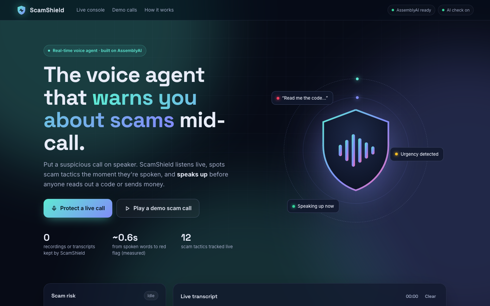

# ScamShield 🛡️ — a live voice guardian for phone calls

> A grandmother gets a call: *"This is your bank. Your account is locked. Read me the code we just sent you."*
> ScamShield is listening on the laptop or phone next to her. Before she reads out a single digit, it chimes and says out loud:
> **"Stop. This may be a scam. Never give a caller your verification code. Hang up."**

ScamShield streams the call (on speakerphone) to **AssemblyAI Universal-Streaming**, checks every partial transcript for scam tactics as the words arrive, gets a second opinion from an LLM at each end of turn, and **speaks a short, specific warning** at the moment it matters.

Built for the **AssemblyAI Voice Agent Hackathon 2026** (lablab.ai).

**Live demo:** https://scamshield-lilac.vercel.app · **Video:** _coming soon_



---

## Try it in 60 seconds
1. Open the live demo and scroll to **Play a real-sounding call**.
2. Click **Fake bank — asks for OTP**. The call audio plays *and* streams through the real AssemblyAI pipeline — nothing is pre-transcribed.
3. Watch words appear ~0.5–0.6 s after they're spoken, red flags light up mid-sentence, the meter climb LOW → MEDIUM → CRITICAL, and ScamShield **interrupt out loud**.
4. Click **Fake courier — you ask ScamShield**: mid-call the victim says *"ScamShield, is this real?"* and hears the answer out loud — then the card-details request sets off the alarm.
5. Click **Jaali bank call — Urdu / Hindi (beta)**: the same protection in Urdu/Hindi, with a spoken Urdu warning.
6. Click **Real call — son talks bank & codes**: a genuine call full of "bank", "transfer", "code" and "password". It stays green.
7. Click **Try it with your voice**, allow the microphone, and read the scam lines shown on screen.

## What happens on a call
| Stage | What ScamShield does |
|---|---|
| 🎙️ **Listen** | Mic audio → AudioWorklet → resampled to 16 kHz PCM → 50 ms chunks → AssemblyAI WebSocket. |
| 📝 **Transcribe live** | Partial words stream back and are shown immediately; formatted final turns lock in, labelled **Speaker A / B** with AssemblyAI's live speaker labels. |
| 🚩 **Instant rule check** | Every partial is scanned in < 1 ms for *who is asking for what* — a code, a PIN, remote access, gift cards, money under pressure — across 12 tactics. |
| 🧠 **AI second opinion** | At each end of turn, Gemini reads the call so far (rate-limited to one request every 4 s) and can raise the risk on scams the rules don't know. |
| ⚖️ **Decide** | LOW / MEDIUM / HIGH / CRITICAL, with a one-line reason: *"Caller is asking for a verification code and is rushing you."* |
| 🗣️ **Speak** | **HIGH:** one calm spoken caution. **CRITICAL:** chime, call audio ducks, full-screen *Stop — possible scam* with **what** is happening, **why** it's dangerous and **what to do**, plus a short spoken warning. Each danger is announced once; a *new* danger can re-alarm after a 12 s cooldown. |
| 💬 **Answer** | Say *"ScamShield, is this real?"* (or tap the button) and it answers out loud from the call context. When risk is high, the answer is always a warning. |
| ⏱️ **Prove it's live** | The alarm shows *"Flagged 0.5 s after the words were spoken"*, measured from AssemblyAI's own word timestamps. |
| 🌏 **Urdu / Hindi (beta)** | Switch the call language and ScamShield uses AssemblyAI's multilingual real-time model (`u3-rt-pro`), detects scam requests in Roman Urdu/Hindi ("OTP code mujhe bataiye"), and speaks the warning in Urdu. |
| 📋 **Report** | Verdict, timeline of red flags with quotes and speakers, next steps, and one-tap sharing with family (WhatsApp / email / download). Stays on the device. |

## How AssemblyAI is used
- **Universal-Streaming v3** (`wss://streaming.assemblyai.com/v3/ws`), 16 kHz `pcm_s16le`, 50 ms chunks.
- **Temporary tokens** from `/api/token` (60 s to connect, sessions capped at 15 min and renewed automatically) — the API key never reaches the browser.
- **Partial transcripts** drive the instant rule layer, so a red flag can appear before the caller finishes the sentence.
- **End of turn** (`end_of_turn`) triggers the AI second opinion; **formatted turns** (`format_turns=true`) give clean final text.
- **Speaker labels** (`speaker_labels=true`) show who said what in the transcript and report.
- **Multilingual real-time model** (`speech_model=u3-rt-pro`, `language_detection=true`) for Urdu/Hindi calls.
- **Word timestamps** turn into a real, per-alarm measurement of detection latency.
- **Keyterm prompting** (`keyterms_prompt`) boosts scam vocabulary — "OTP", "AnyDesk", "gift card", "Western Union", "safe account" — and the wake word "ScamShield".
- **Resilience:** 10 s connect timeout, automatic reconnect with back-off (and waiting for the network to return), keyterms retried off if refused, clean `Terminate` on hang-up.

## Measured, not claimed
Live end-to-end runs of the 6 demo calls through real AssemblyAI streaming (Sep 2026):

| Metric | Result |
|---|---|
| Spoken word → on screen (partial transcript, which drives the red flags) | **~0.5–0.6 s** |
| End of sentence → final formatted turn | **~0.4–0.7 s** without speaker labels, **~0.8–1.4 s** with them (median per call) |
| Spoken word → alarm (shown on screen, English) | **~0.5 s** |
| Scam demos reaching CRITICAL + spoken warning | **6 / 6** incl. Urdu (rules alone are enough — the demos don't depend on the AI) |
| Genuine demo calls with any alarm | **0 / 2** |

Detection quality (`node scripts/eval.js`, `--ai` for the full system):

| Test set | Rules only | Rules + AI |
|---|---|---|
| Own scenarios (33) | 18/18 scams, 0/13 false alarms | — |
| Blind set 1 (45, written without seeing the detector) | *first run:* 11/15 scams, 3/25 false alarms → after fixing the root causes: 15/15, 0/25 | — |
| **Blind set 2** (50, never used for tuning) | **11/18 scams caught, 1/25 false alarms** | **18/18 scams caught, 1/25 false alarms** |

The one false alarm on blind set 2 ("you can just pay me when the job's done" from a plumber) was fixed afterwards; the blind-2 numbers above are the honest pre-fix measurement. With the AI on, suspicious-but-not-yet-dangerous openers tend to be rated HIGH rather than MEDIUM — deliberately cautious.

## Safety design
- **The AI can only raise risk, never lower it.** A scammer saying *"this call is verified safe"* can't talk the meter down. On its own the AI can reach HIGH (spoken caution); the full CRITICAL alarm also needs a rule signal, so one model mistake can't sound it.
- **Prompt-injection guard:** the transcript is fenced as untrusted data; instructions inside it are treated as a scam signal. When risk is high, a spoken answer that isn't a warning is replaced by the rule-based one.
- **No over-warning:** one alarm per danger, 12 s cooldown for new dangers, a code request and a PIN request count as the same danger.
- **Graceful failure:** AI down → rules only; speech service down → demos fall back to a clearly labelled *simulated* transcript; mic denied, disconnected or missing → a plain-language message; speech synthesis unavailable → chime + vibration + visual alarm.

## Privacy
- ScamShield stores **no audio and no transcripts** on any server, and logs no call content. The transcript lives in the browser tab until you press **Clear** or close the page.
- Audio is streamed to **AssemblyAI** for transcription under AssemblyAI's terms.
- With **Deeper AI check** on (the default), transcript **text** is sent to **Google Gemini**. On Gemini's free tier Google may retain and review that text — switch the toggle off for sensitive calls and ScamShield runs on its on-device rules only.
- Keys stay server-side; the browser only ever receives a single-use, short-lived streaming token.

## Limitations (honest)
- It hears only what the microphone picks up: the call must be on speaker, near the device.
- Rules alone miss scams phrased without a clear request (e.g. some investment or refund scams); the AI covers many of these but can be slow on the free tier.
- Speaker labels are shown but not used for scoring — live labels can change mid-call.
- Urdu/Hindi is **beta**: it works well when speakers pause between turns (as on real calls), but long unbroken monologues may be transcribed late or missed by the multilingual model, and latency is ~1 s. The spoken Urdu warnings are pre-recorded (free macOS Hindi voice), so they cover the main dangers rather than every sentence.
- It is a second pair of ears, **not a guarantee**.

## Security
Strict Content-Security-Policy (no inline scripts; connections only to this site and AssemblyAI), `frame-ancestors 'none'`, microphone allowed for this site only, same-site checks and per-client + per-instance rate limits on the API, request size limits, all transcript and AI text HTML-escaped, and no provider error details returned to the browser. The in-memory rate limits are per serverless instance; for heavy public traffic, add Vercel Firewall rate limiting or a shared store.

## Architecture
```
 Mic / demo call ─► AudioWorklet ─► 16 kHz PCM (50 ms) ─► AssemblyAI Universal-Streaming (token from /api/token)
                                                                │ partial + final turns, speaker labels
                                         ┌──────────────────────┴───────────────────────┐
                                         ▼                                              ▼
                        Rule layer (browser, every partial, <1 ms)       AI second opinion (/api/analyze → Gemini,
                                         │                                each end of turn, ≤1 per 4 s)
                                         └───────────► combineRisk (AI can only raise) ◄┘
                                                                │
                                   LOW · MEDIUM · HIGH (spoken caution) · CRITICAL (alarm + voice)
                                                                ▼
                         Speech synthesis + chime + ducked call audio · report · "ScamShield, is this real?"
```

## Run locally
```bash
git clone https://github.com/bano1397/scamshield && cd scamshield
cp .env.example .env        # add ASSEMBLYAI_API_KEY and GEMINI_API_KEY (both have free tiers)
npm run dev                 # http://localhost:3000
npm test                    # unit, API and platform tests
node scripts/eval.js        # detection quality report (add --ai with the dev server running)
```
No dependencies to install (Node 18+). `npm run demo-audio` regenerates the demo calls with macOS voices and ffmpeg.

## Deploy (Vercel)
Import the repo, framework preset **Other**, no build command. `public/` is served statically, `api/*.js` become serverless functions and `vercel.json` adds the security headers. Add `ASSEMBLYAI_API_KEY` and `GEMINI_API_KEY` for Production and Preview, then redeploy.

## Project layout
```
api/        token.js · analyze.js · health.js          (serverless functions)
lib/        http.js · guard.js                         (JSON helpers, same-site checks, rate limits)
public/     index.html · css/style.css · demo/ · audio/
public/js/  app.js (UI, streaming, voice) · rules.js (detector + warning policy) · resample.js · pcm-worklet.js
tests/      rules · api · platform tests, labelled corpora (own, blind 1, blind 2, Urdu)
scripts/    eval.js (detection report) · make-demo-audio.js
```

## What's next
Native call-screening integration on Android, more languages (Urdu script, Spanish), and a trusted-contact alert that notifies family in real time.
